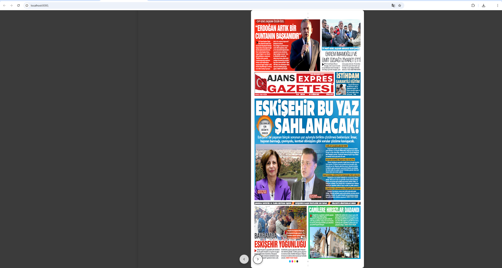
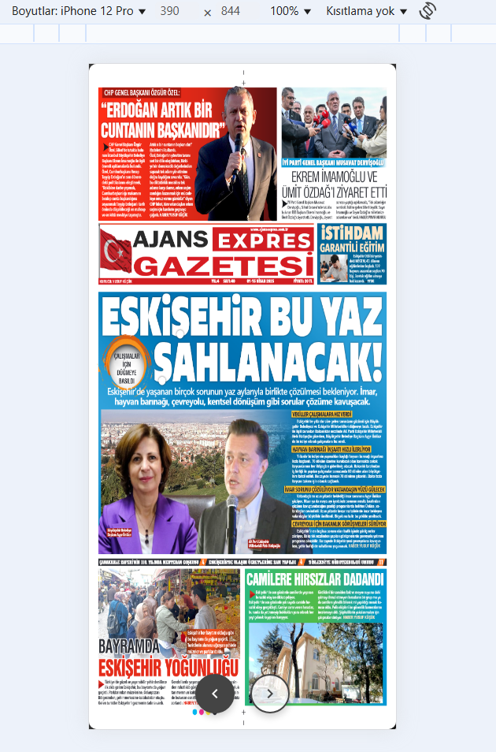
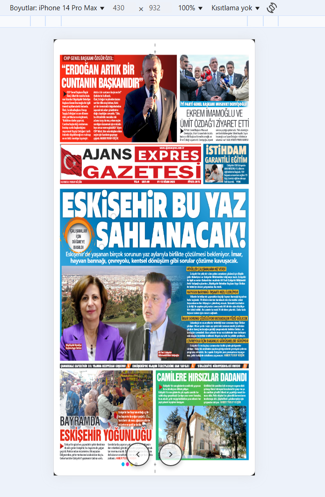
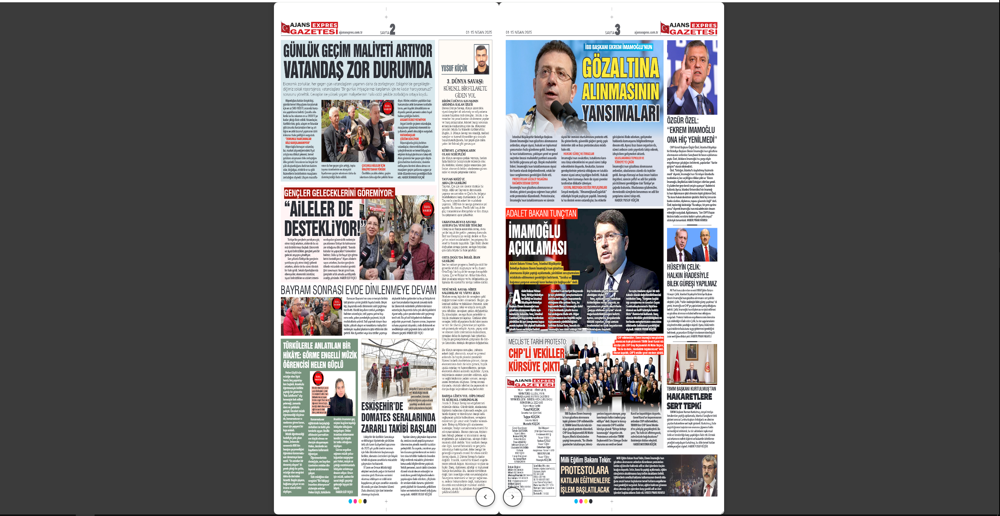
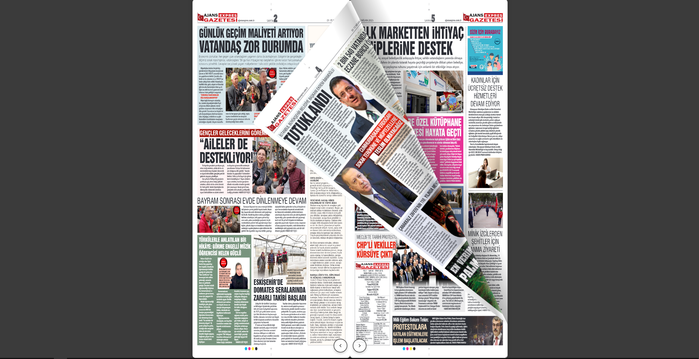
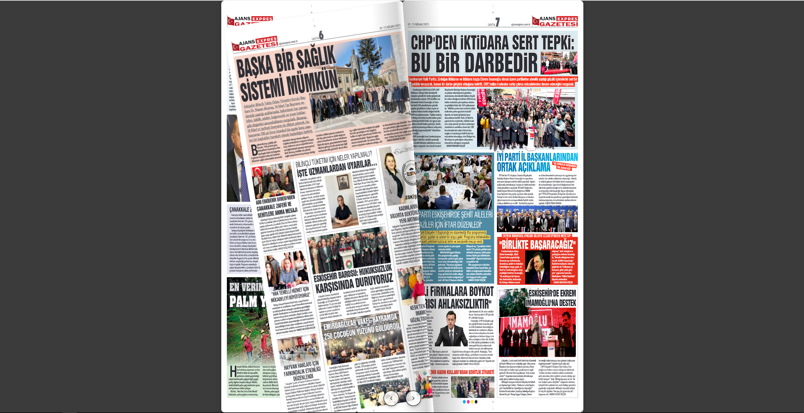

📘 EBSFlipX - PDF Flipbook Viewer

EBSFlipX allows you to present your PDF documents with a stylish and interactive flipbook (page-turning) effect. It's designed to create an engaging PDF viewing experience for your web projects.

--------------------------------------------------

🚀 Features

- Displays PDF pages as .png images
- Realistic page-turning animation powered by turn.js
- Fully customizable via CSS
- Audio effects support for immersive experience
- Responsive layout for both mobile and desktop

--------------------------------------------------

📁 Folder Structure

- /EBS_pdf_pages   → PNG images for each PDF page
- /css             → Stylesheets for layout and effects
- /includes        → PHP backend files
- /javascript      → JavaScript files for flipbook behavior
- /media           → Audio files for sound effects
- index.php        → Main entry point for the viewer

--------------------------------------------------

📦 Setup

1. Convert your PDF into PNG images and place them inside /EBS_pdf_pages
   (e.g., page_1.png, page_2.png, ...)
2. Upload the project to a PHP-enabled server
3. Open index.php in your browser to launch the flipbook

--------------------------------------------------
## 📸 Preview - Flipbook Slides

Below is a preview of how EBSFlipX renders PDF pages as a flipbook. Each image represents a sample page.

  
  
  
  
  
  

--------------------------------------------------

⚠️ License: This project is licensed under the Apache License 2.0.
🛑 Not for Sale: This software is NOT allowed to be sold. It is intended for personal and open-source project use only.

✨ Easily integrate a flipbook experience into your web project!
